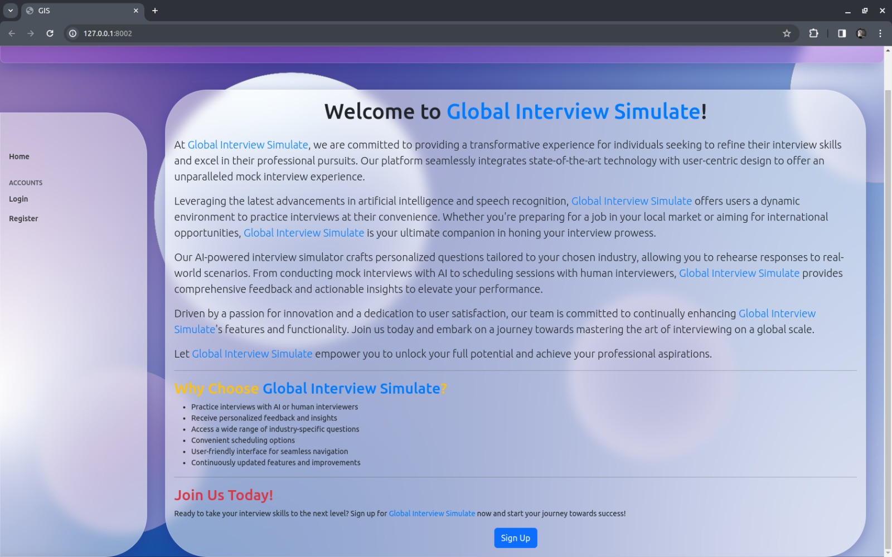
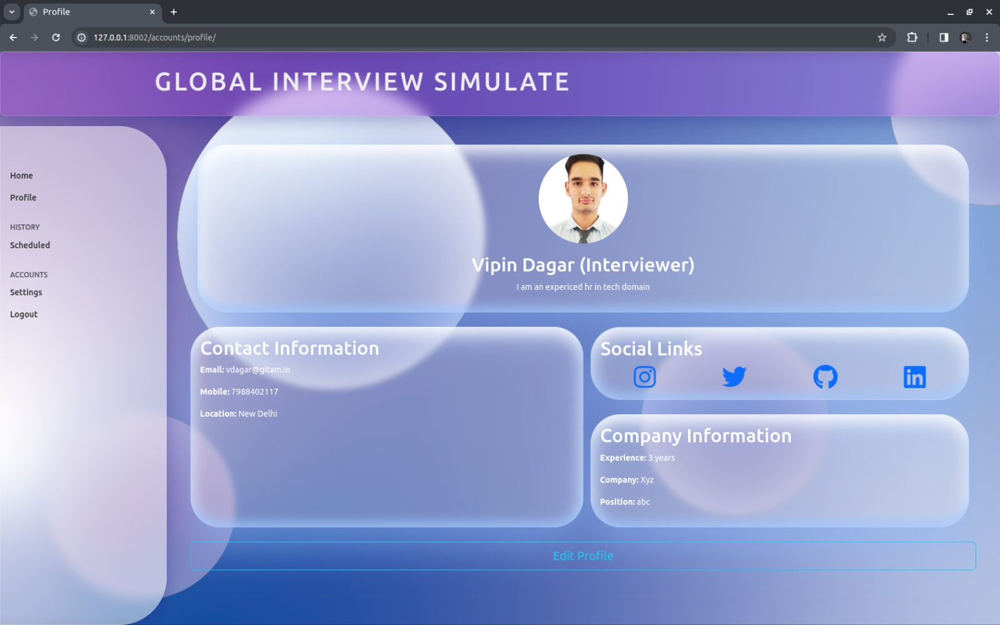
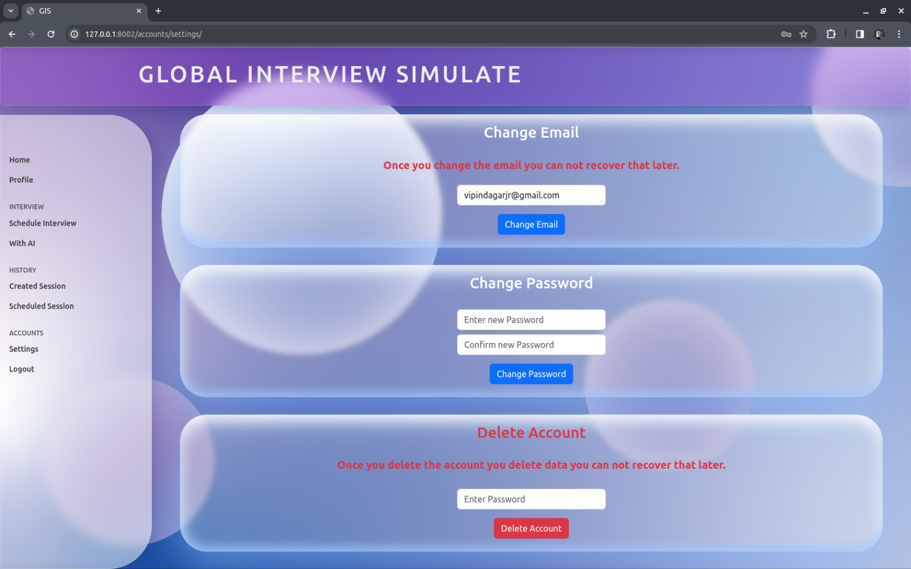
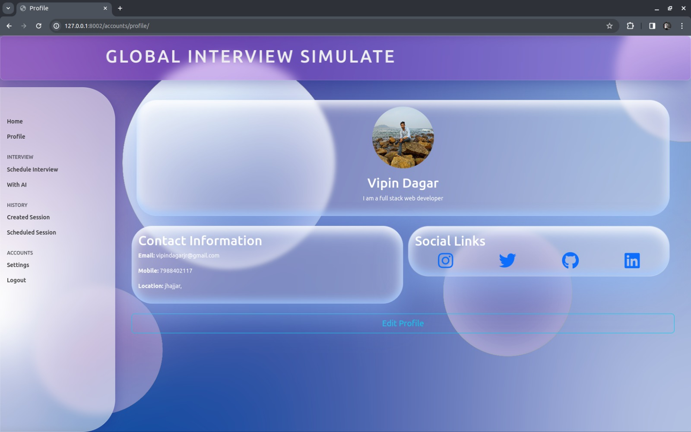
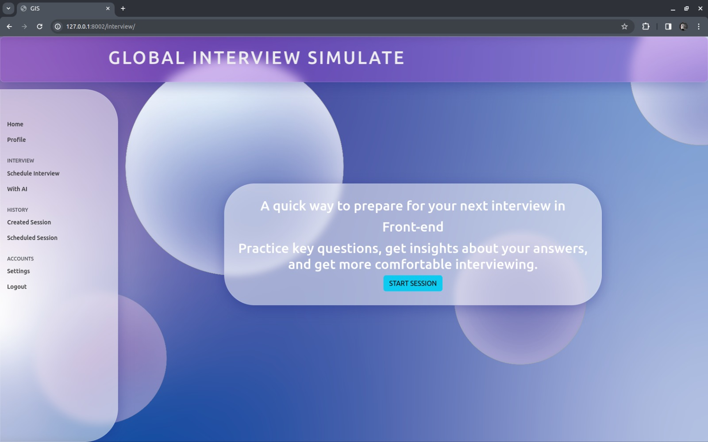
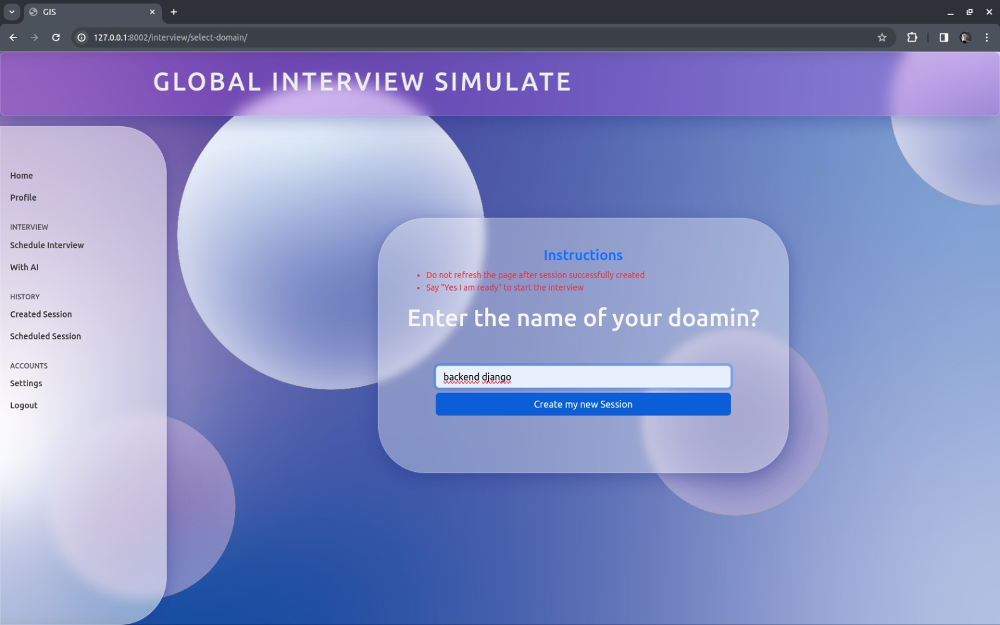
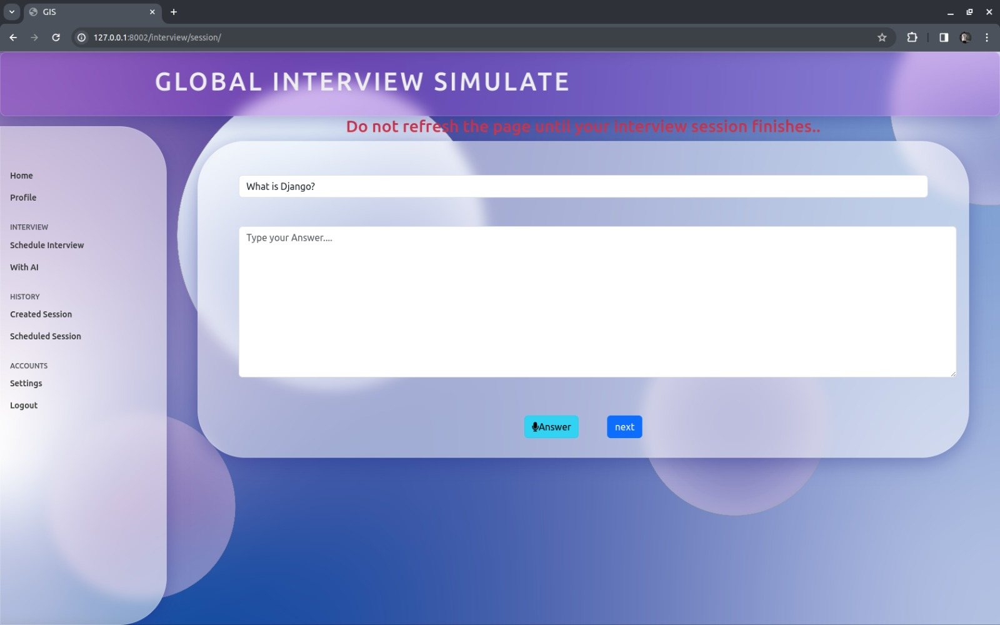
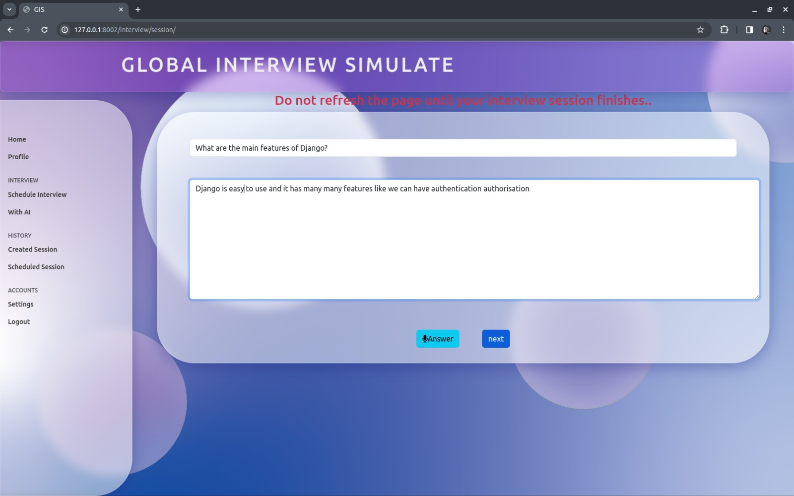
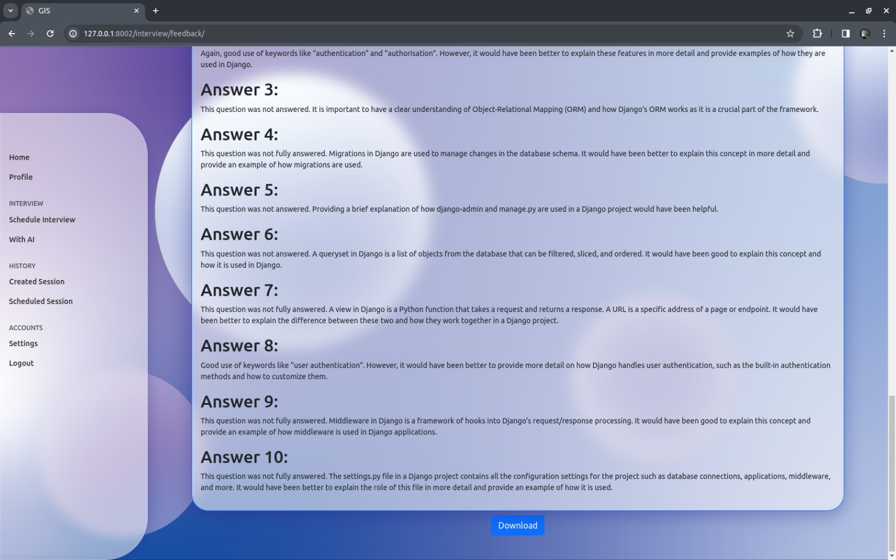

# Interview Preparation Platform

Welcome to the Interview Preparation Platform! This web application is designed to help users enhance their interview skills through AI-driven mock interviews and personalized sessions with human interviewers.

## 🚀 Features

- **User Profiles**: Create and manage user profiles with preferences and availability.
- **Interview Practice Modes**: Choose from beginner, intermediate, and advanced practice modes.
- **Interview Customization**: Customize interviews based on specific topics, industries, or job roles.
- **Interview Insights**: Track performance and receive insights and analytics on areas of improvement.
- **Feedback Collaboration**: Receive feedback from AI and human reviewers, and collaborate with peers.
- **Interview Simulation**: Experience realistic interview scenarios with AI-generated responses.
- **Accessibility Features**: Ensure accessibility for users with disabilities.
- **Mobile Compatibility**: Use the platform seamlessly on mobile devices.
- **Interview Scheduling with Humans**: Schedule personalized sessions with human interviewers.
- **Notification System**: Receive reminders and notifications for scheduled interviews.
- **Data Privacy and Security**: Ensure privacy and security of user data and interview content.

## 🛠️ Installation

1. Clone the repository:
   ```
   git clone https://github.com/vipindagar7/mock-interveiw-with-ai.git
   ```
2. Install dependencies:
   ```
   pip install -r requirements.txt
   ```
3. Run database migrations:
   ```
   python manage.py migrate
   ```
4. Configure settings:
   - Set up environment variables for sensitive information such as email credentials and OpenAI API key.
   - Create a `.env` file in the root directory of your project.
   - Add the following lines to the `.env` file:
     ```
     EMAIL_HOST_USER=your_email@example.com
     EMAIL_HOST_PASSWORD=your_email_password
     OPENAI_API_KEY=your_openai_api_key
     ```

## 🖥️ Usage

1. Run the Django development server:
   ```
   python manage.py runserver
   ```
2. Access the application in your web browser at `http://localhost:8000`.

## 🖼️ Preview












## 🤝 Contributing

Contributions are welcome! If you'd like to contribute to the project, please follow these steps:

1. Fork the repository.
2. Create a new branch (`git checkout -b feature/your-feature`).
3. Make your changes and commit them (`git commit -am 'Add new feature'`).
4. Push to the branch (`git push origin feature/your-feature`).
5. Create a new Pull Request.

## 📄 License

This project is licensed under the [MIT License](LICENSE).

```

```
